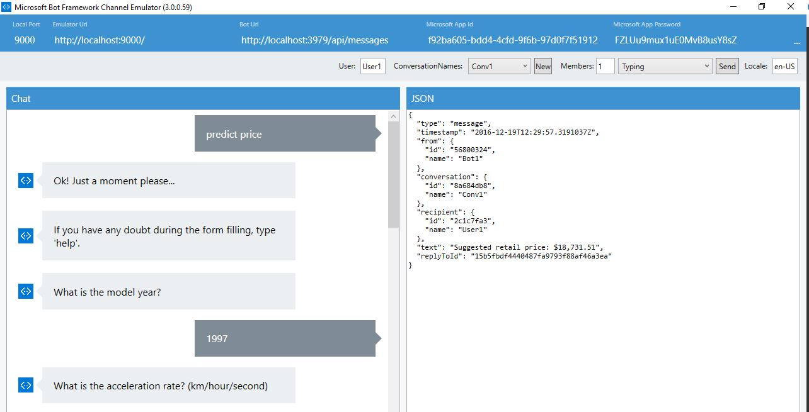
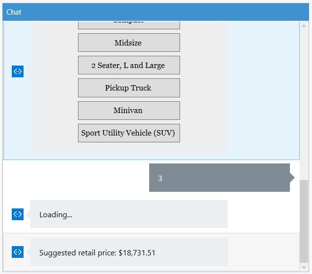

# Bot-MachineLearning
Predicting hybrid car prices integrating Machine Learning and Chat Bots.
The predictive analysis model was created with the [Azure Machine Learning](https://azure.microsoft.com/en-us/services/machine-learning/)] 
and the chat bot was created with the [Azure Bot Service](https://azure.microsoft.com/en-us/services/bot-service/) + [Microsoft LUIS](https://www.luis.ai/).

# How it works?
Download and install the [Bot Framework Emulator](https://docs.botframework.com/en-us/tools/bot-framework-emulator/).
Run the project and then open the Bot Framework Emulator (remember to configure Local Port, Emulator Url, Bot Url and so on).
In the emulator, type something like *"predict price"*.

The bot will ask you the car model year, acceleration rate, fuel economy (MPG), max value of MPG and MPGe and car model class. 

Then, it will provide the suggested retail price.

If you want to know more about predictive analysis with Azure ML and Azure Bot Service, please check out these articles:

* [Cloud-based Predictive Analytics with Azure Machine Learning](https://github.com/fernandoBRS/CommunityDocs-EN/blob/master/MSDN/Azure/predictive-analytics-azure-ml.md)
* [Creating Bots with Azure Bot Service](https://github.com/fernandoBRS/CommunityDocs-EN/blob/master/MSDN/Azure/introduction-bot-service.md)

Do you have any doubt or suggestion? Do you want to contribute to the development of this demo? 
Feel free to contact me! :)